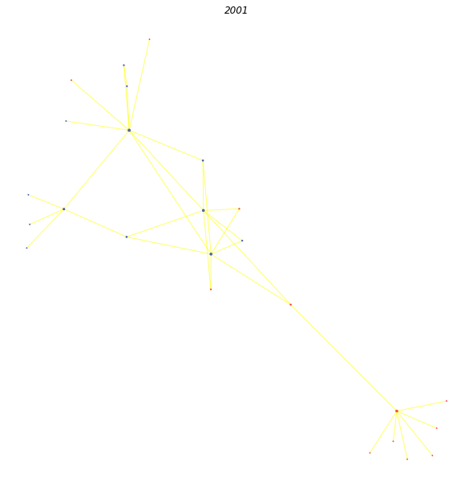

# Exploring Wikipedia's Network Structure in a Temporal Fashion
Authors: Felix Borum Burmester & Christian Vestergaard Djurhuus.

In this notebook, we will explore the temporal development of Marvel- and DC-Comics. We have used the Wikipedia Revisions api to scrape the Wikipedia pages of 2303 superheroes since the dawn of Wikipedia. We have used these pages to create a directed, temporal graph object that will allow us to understand the development of revisions.

We have also webscraped meta data from lists of female, black, latino, and asian superheroes and villains. With this meta data we were able to appoint node attributes to our graph with the help of document similarity (since different websites may call superheroes by different versions of their names).

The red nodes here are Marvel characters, and the blue are DC characters!

This investigative notebook will attempt to discover characteristics about the network as well as investigate to its evolution. This will be done by exploring basic statistics of the network and how they evolve, how communities evolve and finally how communities change with time in the network.

Furthermore, with the metadata we have webscraped, we want to investigate whether Wikipedia revisions have followed the same trend as the rest of the world to include more diversity.

View handin_main.html for more info!!

(Different visualization method)

